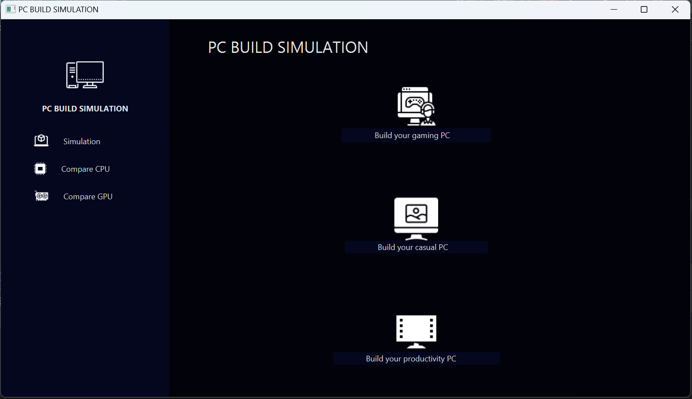
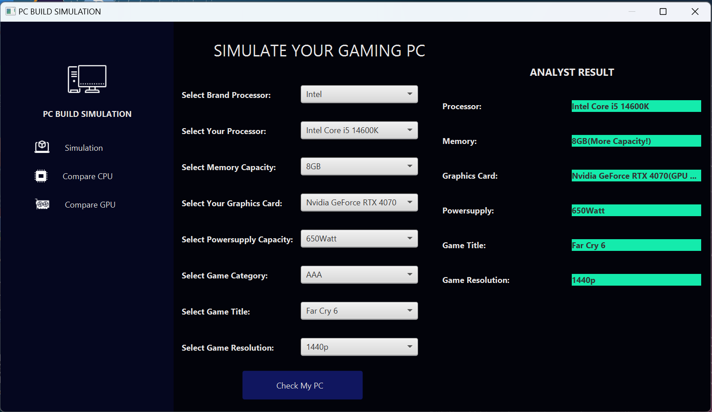
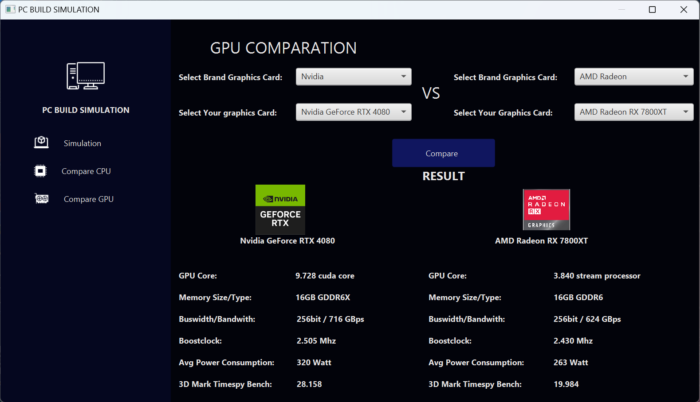
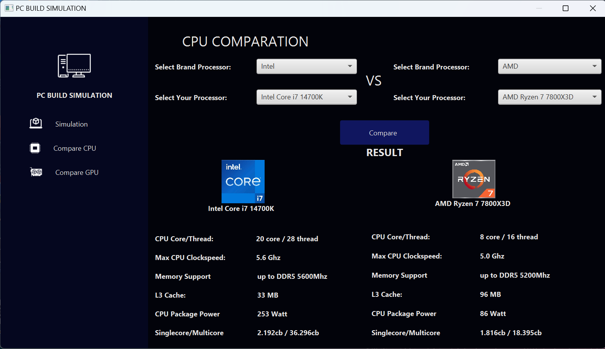

THIS IS UPDATE VERSION FOR 
https://github.com/irfanardi3001/pc-builds/tree/main

# PC-BUILD-SIMULATION

PC-BUILD-SIMULATION adalah aplikasi sederhana yang dirancang untuk membantu pengguna dalam melakukan perbandingan spesifikasi PC untuk berbagai skenario penggunaan. Proyek ini dibuat menggunakan Java dengan GUI berbasis .xml dan dikembangkan di IntelliJ IDEA.



## Fitur Utama

- Perbandingan spesifikasi PC berdasarkan kebutuhan pengguna (gaming, desain grafis, pemrograman, dll.)



- Antarmuka pengguna yang intuitif dan mudah digunakan

## Instalasi

### Prasyarat

Sebelum menginstal proyek ini, pastikan Anda telah menginstal:

- Java Development Kit (JDK) versi 8 atau lebih baru
- IntelliJ IDEA (versi Community atau Ultimate)

### Langkah-langkah Instalasi

1. Clone repositori ini ke komputer Anda:
    ```sh
    git clone [https://github.com/username/PC-BUILD-SIMULATION.git](https://github.com/irfanardi3001/pc-builds.git)
    ```
2. Buka proyek ini di IntelliJ IDEA:
    - Pilih `Open` dari menu `File`
    - Arahkan ke direktori tempat Anda meng-clone repositori ini, kemudian pilih folder `PC-BUILD-SIMULATION`

3. Konfigurasi JDK di IntelliJ IDEA:
    - Buka `File > Project Structure`
    - Di bawah `Project Settings`, pilih `Project`
    - Set `Project SDK` ke versi JDK yang telah Anda instal

4. Jalankan proyek:
    - Klik kanan pada file utama (`Main.java`) dan pilih `Run`

## Penggunaan

1. Jalankan aplikasi melalui IntelliJ IDEA atau dengan menggunakan terminal:
    ```sh
    java -jar PC-BUILD-SIMULATION.jar
    ```
2. Pilih skenario penggunaan yang diinginkan (misalnya: gaming, desain grafis, pemrograman).
3. Masukkan spesifikasi PC yang ingin dibandingkan.
4. Klik tombol `Compare` untuk melihat hasil perbandingan.

## Kontribusi

Kami sangat menghargai kontribusi dari komunitas. Jika Anda ingin berkontribusi, ikuti langkah-langkah berikut:

1. Fork repositori ini.
2. Buat branch baru untuk fitur atau perbaikan Anda:
    ```sh
    git checkout -b fitur-baru-atau-perbaikan
    ```
3. Lakukan perubahan yang diperlukan dan commit:
    ```sh
    git commit -m "Menambahkan fitur baru atau memperbaiki bug"
    ```
4. Push ke branch Anda:
    ```sh
    git push origin fitur-baru-atau-perbaikan
    ```
5. Buat Pull Request di GitHub.

## Lisensi

Proyek ini dilisensikan di bawah lisensi MIT. Lihat file [LICENSE](LICENSE) untuk informasi lebih lanjut.

## Kontak

Jika Anda memiliki pertanyaan atau saran, silakan hubungi kami melalui email: [m.irfanardi3001@gmail.com](m.irfanardi3001@gmail.com)

